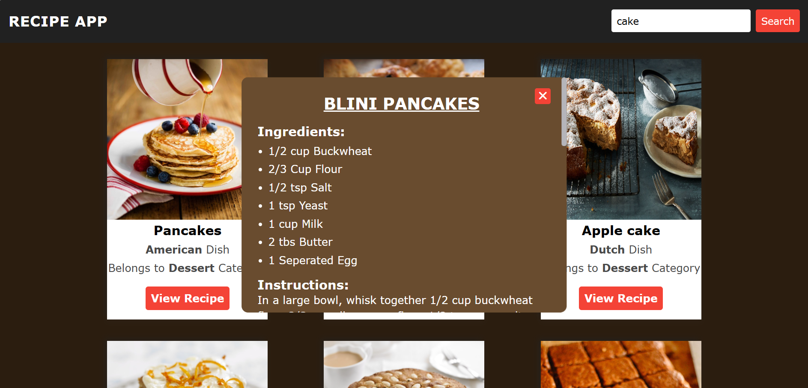

# 🍲 Recipe App

A responsive Recipe App built using HTML, CSS, and JavaScript that fetches real-time recipe data from an API and displays ingredients, instructions, and images.

## 🚀 Features
- 🔍 Search recipes by name
- 📸 Display recipe images
- 📋 Show ingredients and instructions
- ⚡ Fast and responsive UI

## 🛠️ Tech Stack
- HTML
- CSS
- JavaScript
- API (Fetch API)

## 🌐 Live Demo
👉 https://nilabh-kishlay.github.io/Recipe-App/

## 📸 Screenshots

## 📦 Installation
1. Clone the repo:
git clone https://github.com/nilabh-kishlay/Recipe-App.git

2. Open index.html in browser

## 👨‍💻 Author
- Nilabh Kishlay
